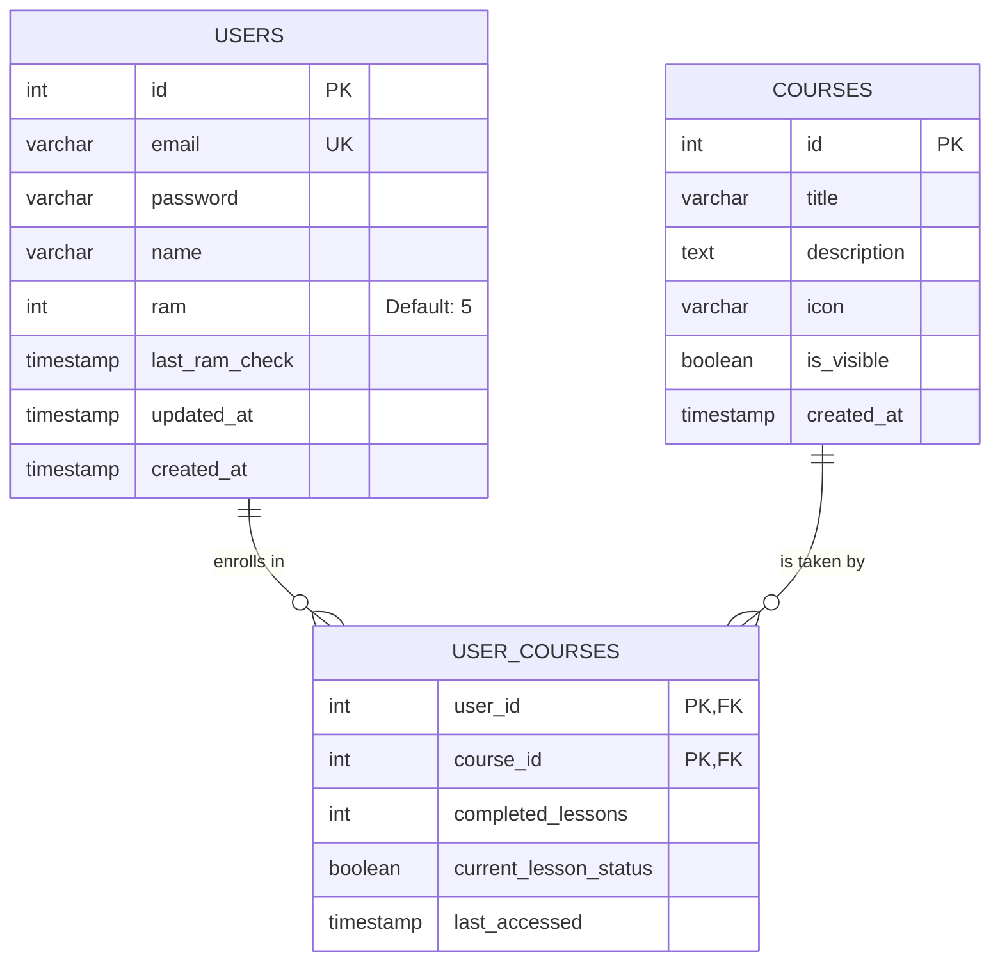
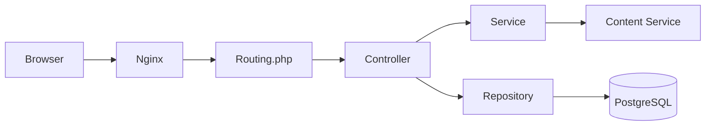

# Programmar

Programmar is a web application designed to help users learn programming languages. The application is built using a custom PHP MVC architecture without external frameworks, adhering to SOLID principles.

## Documentation

### 1. Database Design (ERD)
The current database schema consists of three main tables handling users, courses, and their relationships.

* **Tables**: `users`, `courses`, `user_courses`
* **Relationships**:
    * One-to-Many: `users` to `user_courses`
    * Many-to-Many: `users` to `courses` (via `user_courses`)



### 2. Application Architecture
The project follows the Model-View-Controller (MVC) pattern:
* **Controllers**: Handle request logic (e.g., `SecurityController`, `CourseController`).
* **Repositories**: Manage database operations (e.g., `UserRepository`).
* **Services**: Handle external data fetching (e.g., `ContentService`).
* **Views**: HTML templates rendered by the controllers.



### 3. Screenshots
* Login Page: `docs/screenshots/login.png`
* Dashboard: `docs/screenshots/dashboard.png`
* Course Catalog: `docs/screenshots/catalog.png`

## Installation and Setup

### Prerequisites
* Docker
* Docker Compose

### Step-by-Step Guide
1. Build and run the containers:
   ```bash
   docker-compose up -d --build
   ```

2. Access the application:
   * Web App: http://localhost:9000
   * Database: http://localhost:9002

## Testing

### Manual Scenarios
1. **Authentication**:
   * Navigate to `/register` and create an account.
   * Log in at `/login`.
   * Verify redirection to `/dashboard`.
   * Attempt to access `/dashboard` after logging out (should redirect to login).

2. **Course Management**:
   * Navigate to `/courses` and start a course.
   * Verify the course appears in `/my-courses`.

### Automated Tests
* **Unit/Integration Tests**: Run PHPUnit tests for repositories.
  ```bash
  docker-compose exec php vendor/bin/phpunit tests/
  ```
* **API Endpoint Tests**: Run the Bash script to check HTTP status codes.
  ```bash
  bash tests/api_tests.sh
  ```

## Project Requirements Checklist

### General
- [x] Topic Approved
- [x] Technologies: Docker, GIT, HTML5, CSS, JS, PHP, PostgreSQL
- [x] No Frameworks used

### Architecture and Design
- [x] MVC Architecture
- [x] Aesthetic and Responsive Design (CSS)
- [x] Security (Session, Password Hashing, CSRF)

### Application Elements
- [x] Login Process
- [x] Session Maintenance
- [x] User Permissions (RAM System)
- [x] User Management (Register, Update, Delete)
- [x] Logout

### Database
- [x] Relational Structure (1:N, M:N)
- [ ] Relation 1:1 (does not make sense in the context of this project)
- [ ] Minimum 2 Views (does not make sense in the context of this project)
- [ ] Minimum 1 Trigger
- [ ] Minimum 1 Function
- [ ] Transactions on appropriate isolation level
- [x] 3NF Normalization
- [x] Exported SQL file (`init.sql`)

### Documentation
- [x] README.md
- [x] ERD Diagram
- [x] Screenshots
- [x] Architecture Diagram
- [x] Startup Instructions
- [x] Test Scenarios
- [x] Checklist
- [x] SOLID Principles
- [x] Git Repository History
- [x] No Code Duplication
- [x] Global Error Handling (400, 403, 404, 500)

## Notice
Actual exercises are located in a different repository and are proprietary.
Assume that if any exercise is on the `master` branch in this repository it also uses MIT License.
If any exercise is on a non-`master` branch, assume it is there by mistake and should not be used or shared.

## License
This project is licensed under the MIT License - see the [LICENSE](LICENSE.md) for details.
